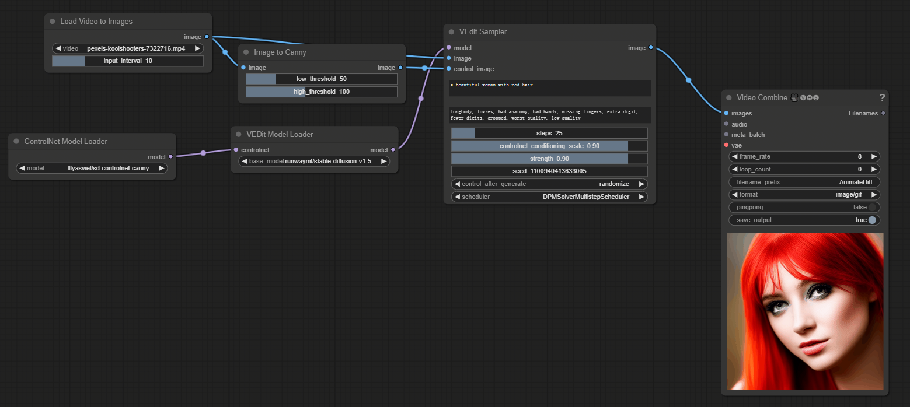

# ComfyUI nodes to use M3net

https://github.com/SingleZombie/DiffusersExample/tree/main/ReplaceAttn

## Install

- 推荐使用管理器 ComfyUI Manager 安装（On the Way）

- 手动安装：
    1. `cd custom_nodes`
    2. `git clone https://github.com/leeguandong/ComfyUI_VideoEditing.git`
    3. 重启 ComfyUI

## Use

- 节点：
  - "Load Video to Images": 将视频转成图片   
  - "Image to Canny": controlnet使用的canny算子
  - "ControlNet Model Loader": controlnet模型加载
  - "VEDit Model Loader": SD 模型加载
  - "VEdit Sampler": 推理

## Stars 

